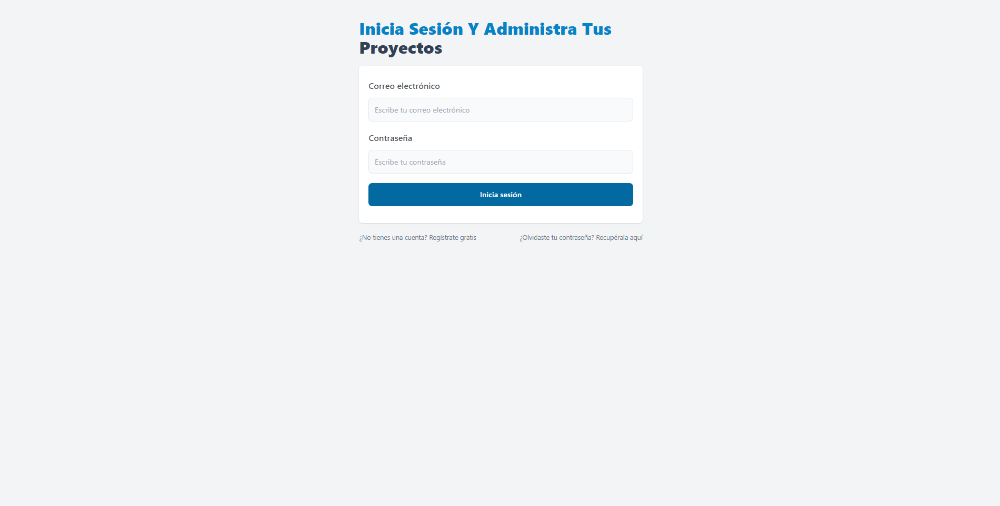
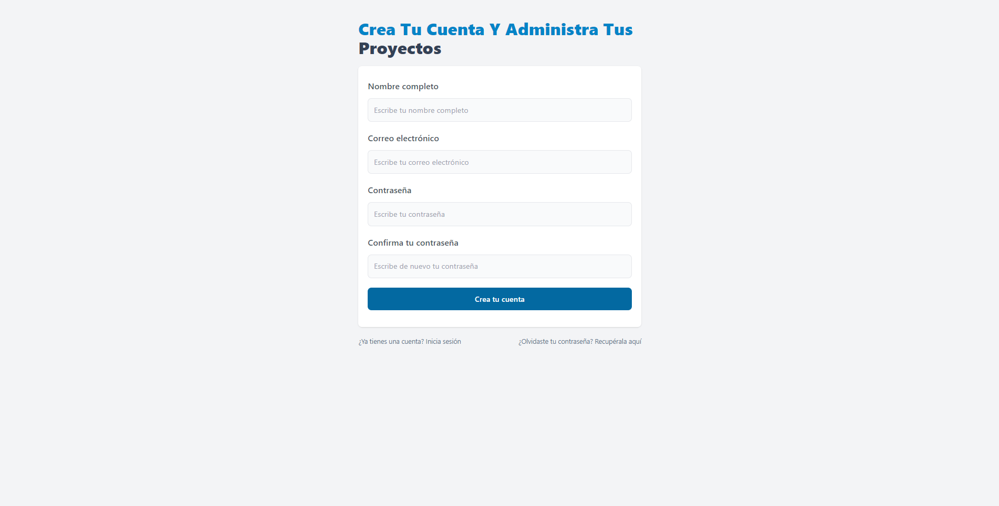
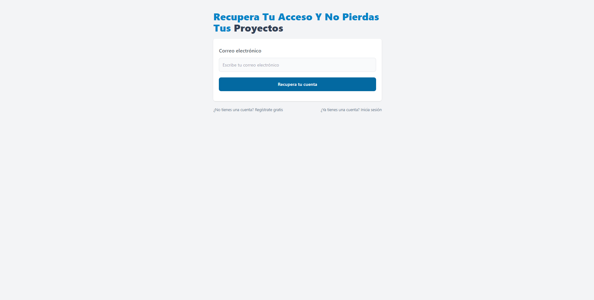
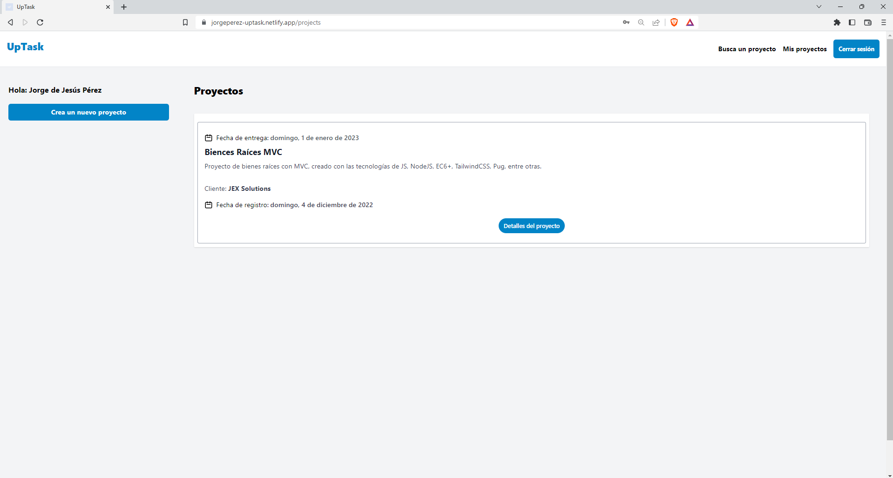
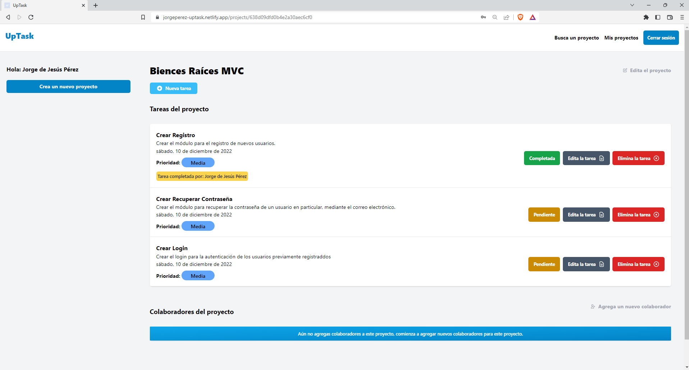
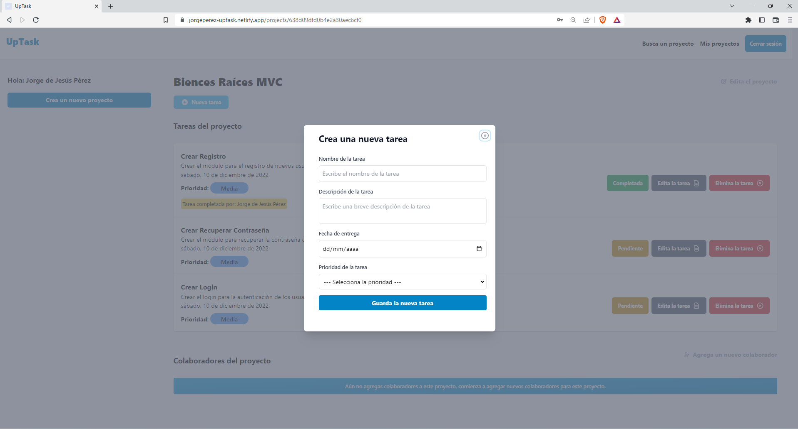
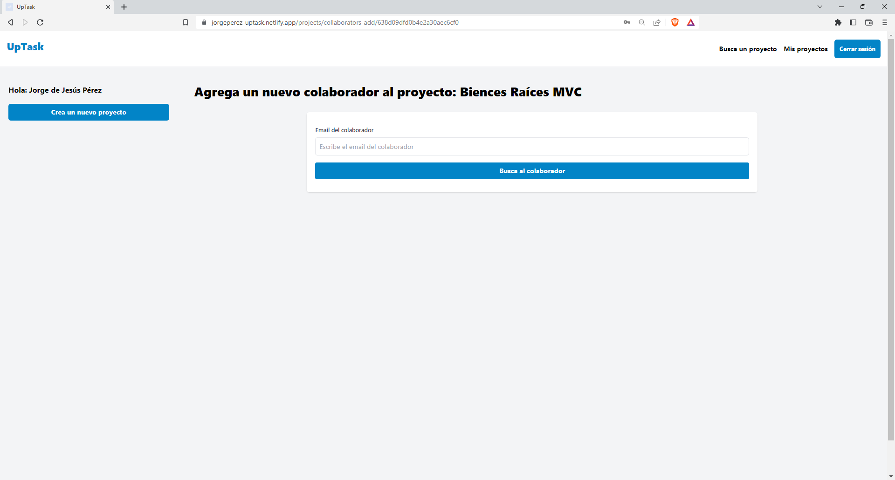
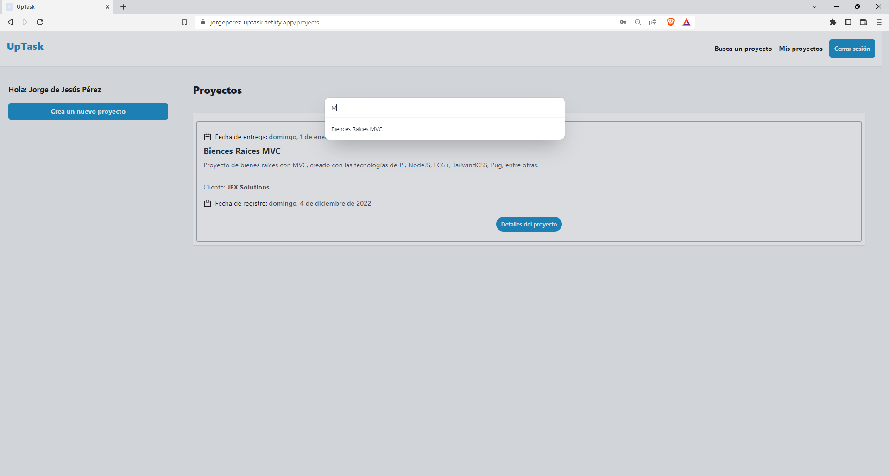
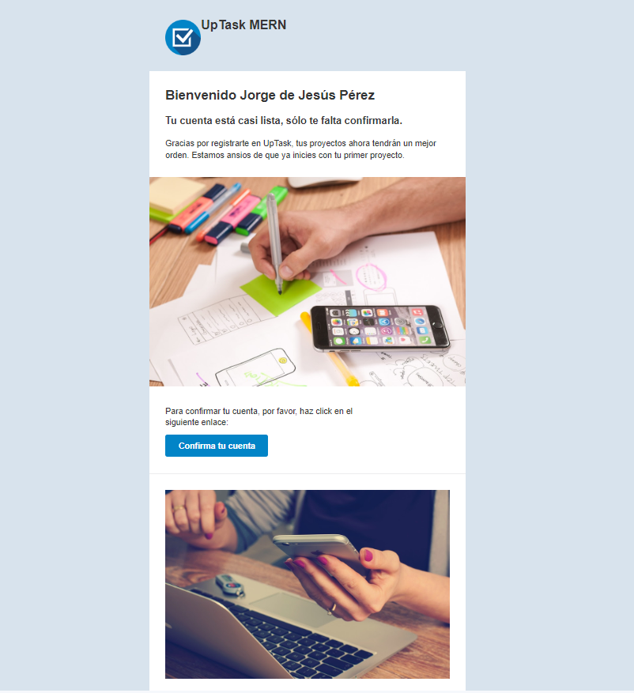

# UpTask MERN Jorge Perez

## [Jorge de Jesús Pérez López](https://portfolio-jorgeperez.netlify.app/)

## UpTask MERN ✍🏻🗒️

This project was developed following the course React - [React - La Guía Completa: Hooks Context Redux MERN +15 Apps](https://www.udemy.com/course/react-de-principiante-a-experto-creando-mas-de-10-aplicaciones/) taught by Professor [Juan de la Torre](https://codigoconjuan.com/). 👨🏻‍💻

The application allows you to register, having its security module 100% functional; You validate your account through the email with which you register, you can recover your password in case you have forgotten it and it allows you to log in.

Once inside the application, you can create new projects, for each project you can add new collaborators (who must previously be registered), it allows you to add new tasks and manage them, adding statuses such as "Pending" or "Completed". You can edit the task or delete it, likewise, the task shows the name of the person who completed it.

Being a 100% functional project, it has thought of everything, and it has sockets so that when a task is completed, added, deleted or modified, the change appears **in real time** to **all connected users** .

The application is quite complete, in this repository you can find the frontend created with ReactJS, TailwindCSS, Axios, among other tools. If you want to access the backend of this application, you can find it at the following link: [Backend UpTask MERN](https://github.com/jodeperezlo/UPTask_MERN_backend).

The application is working in the following link: [UpTask MERN](https://jorgeperez-uptask.netlify.app/).

Some of the technologies used:

- [React JS](https://es.reactjs.org/)
- [Node JS](https://nodejs.org/es/)
- [MongoDB](https://www.mongodb.com/)
- [TailwindCSS](https://tailwindcss.com/)
- [Mongoose](https://mongoosejs.com/)
- [Express](https://www.express.com/)
- [Nodemon](https://nodemon.io/)
- [Axios](https://axios-http.com/docs/intro)
- [Stocket.io](https://socket.io/)

## UpTask MERN ✍🏻🗒️

Este proyecto fue desarrollado siguiendo el curso de [React - La Guía Completa: Hooks Context Redux MERN +15 Apps](https://www.udemy.com/course/react-de-principiante-a-experto-creando-mas-de-10-aplicaciones/) impartido por el profesor [Juan de la Torre](https://codigoconjuan.com/). 👨🏻‍💻

La aplicación permite registrarte, teniendo su módulo de seguridad 100% funcional; validas tu cuenta mediante el correo electrónico con el que te das de alta, puedes recuperar contraseña en caso de que la hayas olvidado y te permite iniciar sesión.

Una vez dentro de la aplicación, puedes crear nuevos proyectos, por cada proyecto puedes agregar nuevos colaboradores (que previamente deben de estar registrados), permite agregar nuevas tareas y administrarlas, agregando estados como "Pendiente" o "Completada". Puedes editar la tarea o eliminarla, de igual manera, la tarea muestra el nombre de la persona que la completó.

Por ser un proyecto 100% funcional, está pensado en todo, y cuenta con sockets para que cuando una tarea sea completada, agregada, eliminada o modificada, aparezca **en tiempo real** el cambio a **todos los usuarios conectados**.

La aplicación está bastante completa, en este repositorio puedes encontrar el frontend creado con ReactJS, TailwindCSS, Axios, entre otras herramientas. Si deseas acceder al backend de esta aplicación, se encuentra en el siguiente enlace: [Backend UpTask MERN](https://github.com/jodeperezlo/UPTask_MERN_backend).

La aplicación se encuentra funcionando en el siguiente enlace: [UpTask MERN](https://jorgeperez-uptask.netlify.app/).

Algunas de las tecnologías utilizadas:

- [React JS](https://es.reactjs.org/)
- [Node JS](https://nodejs.org/es/)
- [MongoDB](https://www.mongodb.com/)
- [TailwindCSS](https://tailwindcss.com/)
- [Mongoose](https://mongoosejs.com/)
- [Express](https://www.express.com/)
- [Nodemon](https://nodemon.io/)
- [Axios](https://axios-http.com/docs/intro)
- [Stocket.io](https://socket.io/)

## Folder structure 📁

```
├───public
└───src
    ├───components
    ├───config
    ├───context
    ├───helpers
    ├───hooks
    ├───layouts
    └───pages
```

## Installation of dependencies 📦

```cmd
npm install
```

## Run the application in development 🚀

```cmd
npm run start
```

## Build the app for production 🏗

```cmd
npm run build
```

## App 📱💻











